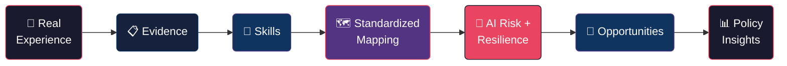
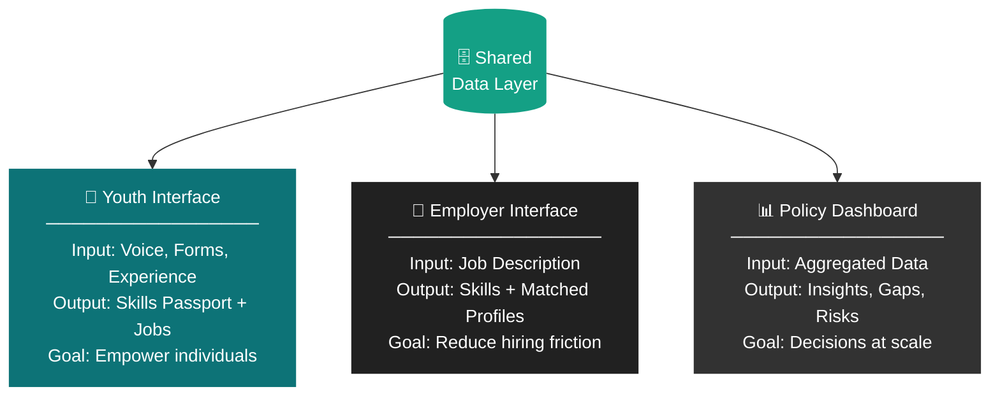
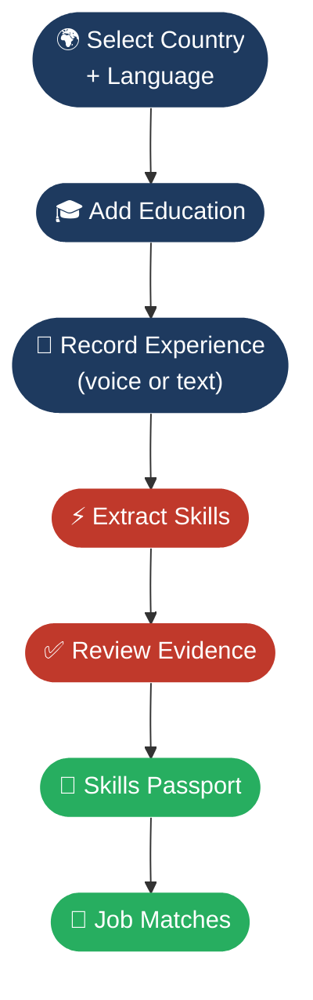
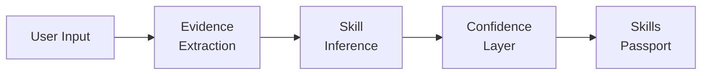
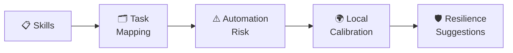
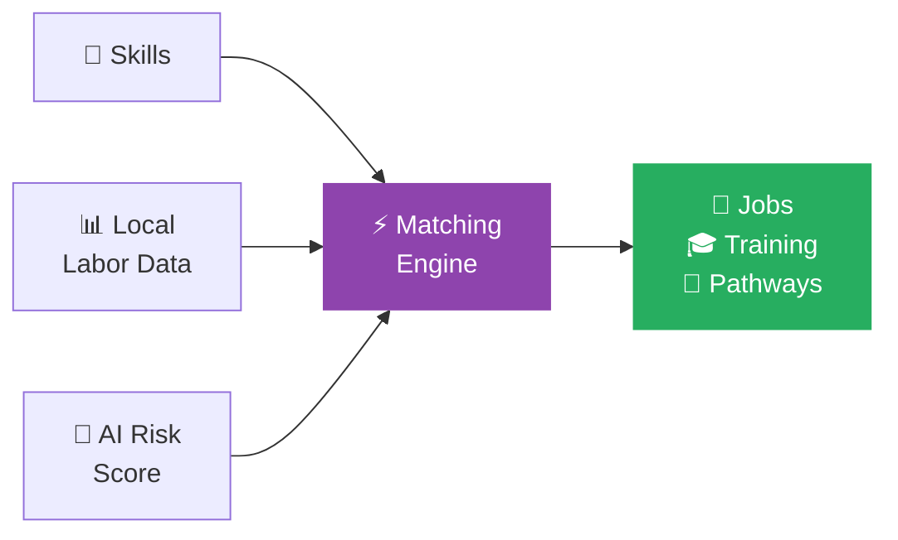
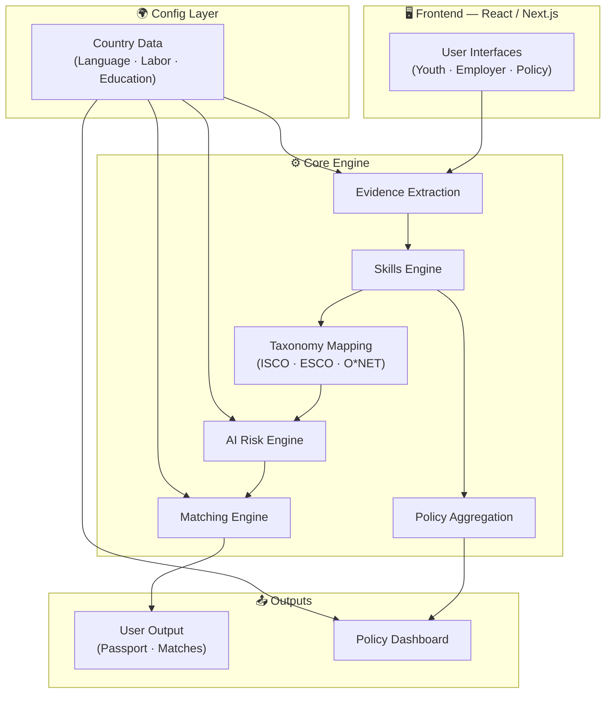
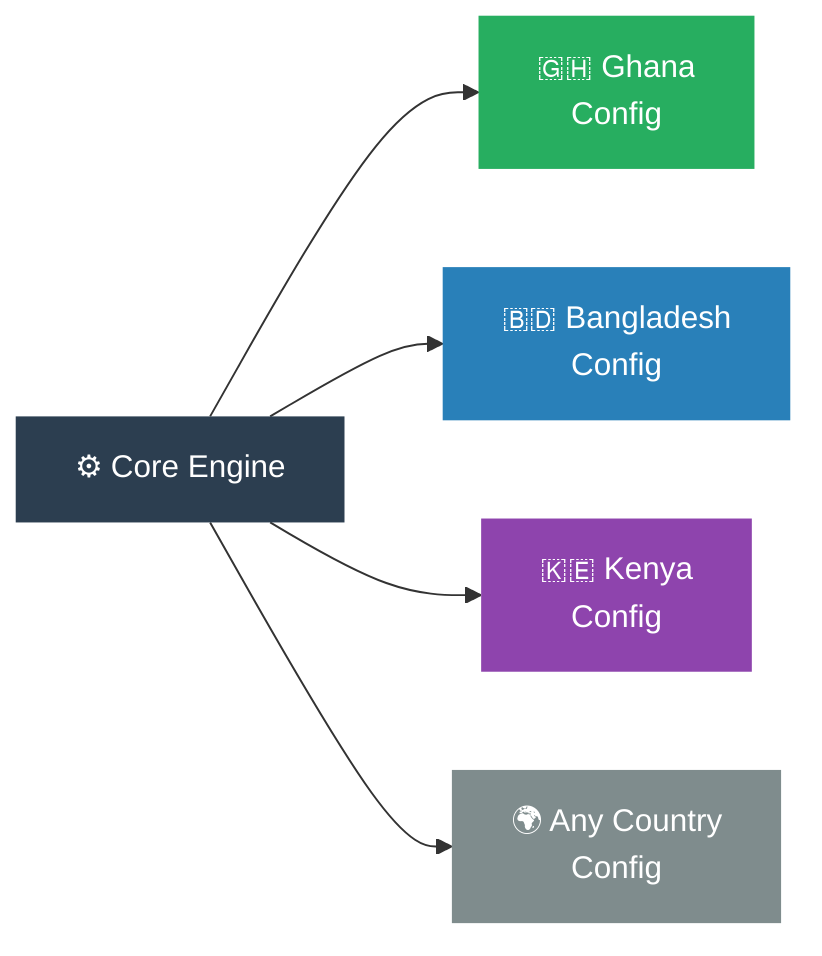

<div align="center">

```
██╗   ██╗███╗   ██╗███╗   ███╗ █████╗ ██████╗ ██████╗ ███████╗██████╗
██║   ██║████╗  ██║████╗ ████║██╔══██╗██╔══██╗██╔══██╗██╔════╝██╔══██╗
██║   ██║██╔██╗ ██║██╔████╔██║███████║██████╔╝██████╔╝█████╗  ██║  ██║
██║   ██║██║╚██╗██║██║╚██╔╝██║██╔══██║██╔═══╝ ██╔═══╝ ██╔══╝  ██║  ██║
╚██████╔╝██║ ╚████║██║ ╚═╝ ██║██║  ██║██║     ██║     ███████╗██████╔╝
 ╚═════╝ ╚═╝  ╚═══╝╚═╝     ╚═╝╚═╝  ╚═╝╚═╝     ╚═╝     ╚══════╝╚═════╝
```

### **Skills Infrastructure for Invisible Talent**

*We don't build better CVs — we remove the need for them.*

---


</div>

---

## 🌍 What is UNMAPPED?

UNMAPPED is a **mobile-first, configurable AI infrastructure layer** that translates informal, real-world experience into **portable, explainable skill signals** — and connects them to **real economic opportunities**.

It is designed for environments where:

| Reality | What UNMAPPED does |
|---|---|
| 📵 Skills exist before credentials | Extracts skills from experience, not diplomas |
| 🤝 Work happens informally | Captures non-traditional evidence |
| 📱 Devices are shared | Optimized for mobile, low-bandwidth |
| 🗂️ Data is incomplete | Works with what people actually have |

---

## 💡 Why This Matters

<div align="center">

```
         THE GAP WE CLOSE
 ┌─────────────────────────────────┐
 │                                 │
 │   TALENT          OPPORTUNITY   │
 │     🧑              💼          │
 │      \              /           │
 │       \            /            │
 │        \          /             │
 │         ?????????               │
 │    (invisible layer)            │
 │                                 │
 │   ──────── UNMAPPED ─────────►  │
 │     🧑 ~~~~~~~~~~~~~~~~~~~~ 💼  │
 │                                 │
 └─────────────────────────────────┘
```

</div>

In many low- and middle-income countries:

- 🎓 Youth have **real skills**, but no formal proof
- 🔍 Employers **cannot verify candidates**
- 🌐 Matching happens through **informal networks**
- 🤖 AI is reshaping jobs faster than systems can adapt

> **The problem is not lack of talent.**
> **The problem is lack of translation between skills and opportunity.**

---

## ⚙️ Core Pipeline



---

## 📱 Product Overview

UNMAPPED consists of **three connected interfaces** — same data, different abstraction levels:



---

## 🔄 Youth User Flow



---

## 🧠 Skills Signal Engine

The system converts raw input into **structured, trustworthy skill signals**:



### Confidence Spectrum

```
LOW ◄──────────────────────────────────► HIGH

  🟡 self-declared    🔵 inferred    🟢 verified

  "I can weld"   →  "Has welding    →  "Passed weld
                     task evidence"    assessment"
```

Key principle: **Evidence-based, not claims-based.**

---

## 🤖 AI Readiness Lens

Not all skills are equal in an AI-driven world.



### Output at a Glance

```
┌─────────────────────────────────────────────┐
│  SKILL RESILIENCE REPORT                    │
│                                             │
│  🔴 At Risk         Data entry, routing     │
│  🟡 Uncertain       Customer service        │
│  🟢 Durable         Care work, negotiation  │
│  📈 Learn Next      Prompt design, QA       │
│                                             │
│  ⚠️  Risk is LOCAL — calibrated per country │
└─────────────────────────────────────────────┘
```

---

## 🔎 Opportunity Matching

We don't recommend *ideal* jobs — we recommend **reachable** ones.



Matching considers: **skill fit · local demand · distance · wage signals · training gaps · AI resilience**

---

## 🏢 Employer Flow

Employers don't need to learn taxonomies.

```
  EMPLOYER TYPES:          EMPLOYER INPUTS:
  ┌──────────────┐         ┌──────────────────────────────┐
  │ SME owner    │ ──────► │ "I need someone who can      │
  │ HR manager   │         │  manage inventory and        │
  │ NGO director │         │  train junior staff."        │
  └──────────────┘         └────────────┬─────────────────┘
                                        │
                                        ▼
                           ┌──────────────────────────────┐
                           │ 🤖 Skill Extraction           │
                           │  → Inventory management      │
                           │  → Team coordination         │
                           │  → Training facilitation     │
                           └────────────┬─────────────────┘
                                        │
                                        ▼
                           ┌──────────────────────────────┐
                           │ 👥 Matched Candidates         │
                           │  Ranked by evidence,         │
                           │  not credentials             │
                           └──────────────────────────────┘
```

---

## 📊 Policy Dashboard

Turns individual data into **system-level intelligence**.

```
╔══════════════════════════════════════════════════════════╗
║           UNMAPPED POLICY DASHBOARD                      ║
╠══════════════════════════════════════════════════════════╣
║                                                          ║
║  🗺️  GLOBAL RISK MAP                                     ║
║  ┌──────────────────────────────────────────────────┐   ║
║  │  🟥 🟥 🟧 🟨 🟧 🟥 🟥 🟥 🟧 🟨               │   ║
║  │  🟧 🟨 🟩 🟩 🟨 🟧 🟥 🟧 🟩 🟩               │   ║
║  │  🟥 🟧 🟧 🟨 🟩 🟩 🟨 🟧 🟧 🟥               │   ║
║  └──────────────────────────────────────────────────┘   ║
║  🟥 High Risk   🟧 Medium   🟩 Resilient                 ║
║                                                          ║
║  📈 TOP SKILL GAPS         🚨 VERIFICATION GAPS          ║
║  1. Digital literacy       Ghana:      62% unverified    ║
║  2. Soft skills            Bangladesh: 74% unverified    ║
║  3. Technical trades       Kenya:      58% unverified    ║
║                                                          ║
╚══════════════════════════════════════════════════════════╝
```

---

## 🧱 Architecture Overview



---

## 🌐 Configurable by Design

One engine. Any country. Zero code changes.



Configurable per context:
`Country` · `Education system` · `Language` · `Labor market data` · `AI calibration` · `Opportunity types`

---

## 🗃️ Data Sources

| Source | What it provides | Used for |
|---|---|---|
| [ISCO](https://www.ilo.org/isco) | Occupational classification | Job mapping |
| [ESCO](https://esco.ec.europa.eu) | Skills & competencies taxonomy | Skill extraction |
| [O*NET](https://www.onetonline.org) | Task-level structure | AI risk analysis |
| [ILOSTAT](https://ilostat.ilo.org) | Labor market data | Demand signals |
| [World Bank WDI](https://data.worldbank.org) | Economic indicators | Local calibration |
| [Frey-Osborne](https://www.oxfordmartin.ox.ac.uk/publications/the-future-of-employment/) | Automation probability | Risk scoring |

---

## 💡 Design Principles

```
┌──────────────────────────────────────────────────────┐
│                                                      │
│  01  No CV required        → use experience          │
│  02  Mobile-first          → no laptop needed        │
│  03  Evidence over claims  → build employer trust    │
│  04  Realistic matching    → not aspirational        │
│  05  Local AI calibration  → risk varies by country  │
│  06  Config not code       → scales without devs     │
│                                                      │
└──────────────────────────────────────────────────────┘
```

---

## 🏁 Outcome

```
                  ┌─────────────────────────────────┐
                  │                                 │
     🧑 Youth  ──►│   Real Opportunities            │
                  │                                 │
     🏢 Employer ►│   Lower Hiring Uncertainty      │
                  │                                 │
     🏛️ Policy ──►│   Actionable Labor Insights     │
                  │                                 │
                  └─────────────────────────────────┘
```

> **UNMAPPED turns invisible talent into visible opportunity.**

---

<div align="center">

*Built for the world's informal economy.*
*Configurable. Portable. Evidence-first.*

</div>
